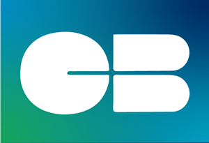
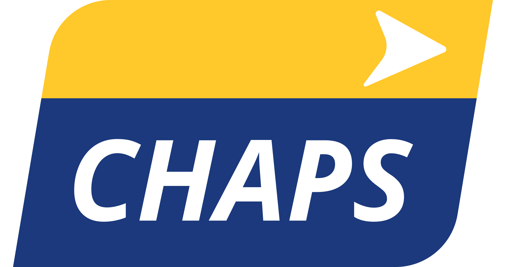
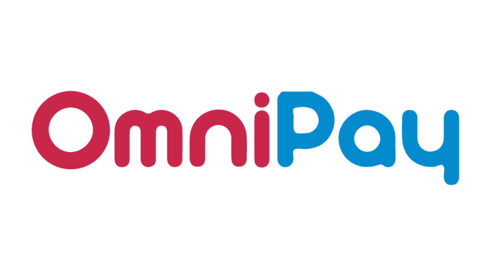
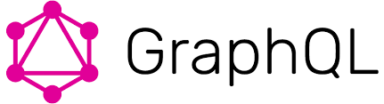

# Hi from [Michal Kucera](https://www.linkedin.com/in/michal-kucera/)! 🙌

As a Software Architect 👷‍♂️, currently located in Barcelona 🏖️, I've been helping Fintech companies with architecting,
developing and maintaining large-scale, highly-available, distributed digital payment applications, as well as
integrating them with 3rd party banking systems.

# Banking systems I've worked with 🏦

> Please feel free to check out my [LinkedIn profile](https://www.linkedin.com/in/michal-kucera) for more details about
> my work experience.

# How does my day-to-day work look like? 💻

- Constantly looking for new innovative methodologies and approaches, building POCs 🤓
- Mentoring/leading/managing my world-class development team 🚀
- Immersed in backend tech such as Spring Framework with the combination of Kotlin 🔥
- Guiding high-level architecture decisions, involved in detailed design 📝
- Transforming caffeine into code 🐛
- Ensuring our software aligns with top quality
  standards ([ISO 25010](https://iso25000.com/index.php/en/iso-25000-standards/iso-25010)) 🕵
- Active in peer code reviews, pair/MOB programming ⚡️
- Troubleshooting across environments, supporting issue resolution 🚑️
- Facilitating stakeholder meetings 🧍
- Conducting technical interviews ✅

and **ALWAYS** giving my best to everything I do! 🎉

# What's my current tech stack? 🏷️

# What do I do in my leisure time? 🏖️

I love to hang up with friends 🍕 🍻, talk to new people, discover new destinations ✈️, hike ⛰️, snowboard 🏂, but also
watch movies/series, listen to podcasts, read a nice book 📖, or attend conferences (
e.g. [Spring I/O](https://springio.net), [Worldwide Software Architecture Summit](https://events.geekle.us/wsas23)) 📈.

# Wanna say hi to me? ☕

# Cheers! 🥂
